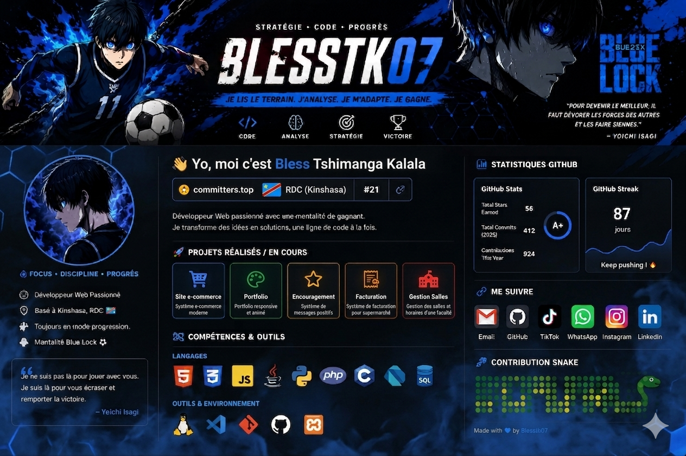

  

# 👋 Oi, moi c’est Bless Tshimanga Kalala

  

> *« Je ne suis pas là pour jouer avec vous. Je suis là pour vous écraser et remporter la victoire. »*   — **Yoichi Isagi (Blue Lock)**

  ⚡ <strong>Stratégie • Code • Progrès</strong> ⚡  
  💻 Développeur Web • 🌍 Kinshasa, RDC 🇨🇩

---

## ⚔️ Mentalité "Blue Lock"

Je suis comme **Yoichi Isagi** : j’analyse le terrain, je m’adapte aux obstacles et je progresse constamment. Le code est mon terrain de jeu — et chaque projet est un match que je joue avec une seule idée en tête : **gagner**.

---

## 👨‍💻 À propos de moi

- **🔭 Statut :** Développeur Web passionné et axé sur la performance.
- **🧠 Technologies :** HTML, CSS, JavaScript, Java, PHP, Python, SQL, C, Dart.
- **🌍 Localisation :** Basé à Kinshasa, RDC 🇨🇩.
- **📚 Évolution :** Toujours en mode apprentissage et à l'affût de nouvelles compétences.
- **🎯 Objectif :** Concevoir des applications web modernes, fluides et dynamiques.
- **📫 Contact direct :** [tshimangabless2000@gmail.com](mailto:tshimangabless2000@gmail.com)

---

## 🚀 Projets Réalisés / En Cours

| Projet | Technologies / Liens | Description |
| :--- | :--- | :--- |
| **🛒 Site E-commerce** |  | Plateforme e-commerce moderne et fluide. |
| **🎨 Mon Portfolio** |  | Portfolio responsive, stylisé et animé. |
| **⭐ Encouragement** |  | Système d'envoi et de partage de messages positifs. |
| **🧾 Facturation** |  | Solution de facturation automatisée pour supermarché en PHP. |
| **🏫 Gestion Salles TP** |  | Application web de gestion des salles et horaires d’une faculté. |
| **📰 Blog Dynamique** |  | Blog dynamique complet développé de A à Z en PHP. |

---

## 🧰 Compétences & Outils

### 🔤 Langages

  

### 🛠️ Outils & Environnement

  

---
## 📊 Statistiques GitHub

  

---

## 🔗 Me Suivre

  
  
  
  
  
  

---

## 💬 Citation Motivante

> *« Pour devenir le meilleur, il faut dévorer les forces des autres et les faire siennes. »*

---

  🙏 Merci d’être passé sur mon profil !  
  N’hésite pas à explorer mes dépôts, me follow ou me contacter pour collaborer 👊🔥

